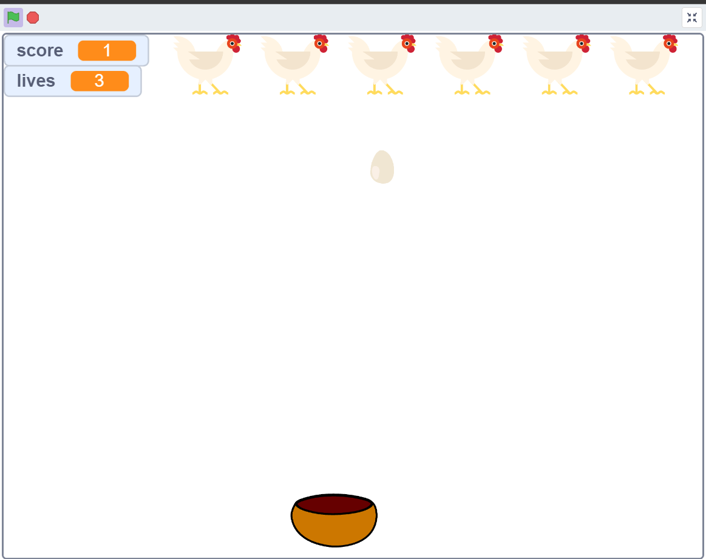

# Week 0 CS50 introduction to computer science scratch assignment

### My scratch project consists of a game that lets the user control a bowl by moving the mouse horizontally. Eggs get dropped from the chickens on the top, initially the eggs speed is slow but it gets faster each time the bowl catches a new egg. You get 3 lives, whenever an egg drops to the floor, you lose a live. 

### In-game screenshot:

